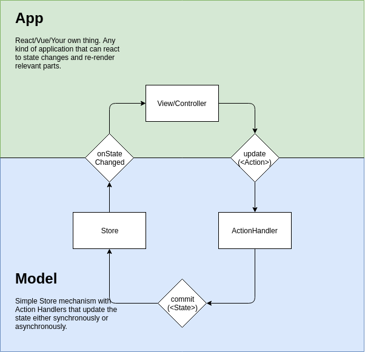

# JacketUI Store

Store based on thinking from [compassionate components](https://www.youtube.com/watch?v=VKQAS3PNEVw&pp=ygUYY29tcGFzc2lvbmF0ZSBjb21wb25lbnRz).

## Philosophy

We want flexibility in our components and escape hatches in order to solve edge cases and make components truly expandable and reusable.

In order to achieve this we need to create flexible components, meaning expandable and full of escape hatches in order to cater for edge cases.

## Features

The Store is based on the Flux-architecture/ELM-architecture with one twist: it supports asynchronous action handlers in addition to the usual synchronous reducer functions.

**Anti-features**: Not synchronous, not pure.
**Features**: Async is first-class member, not an afterthought or delegated to another library.

This means that the store is not synchronous, meaning it does not comform to f(state, action) => state, but rather f(state, action) => [multiple states over time].

## Action handlers

An action handler is essentially the same as a reducer in e.g useReducer. It is a function that takes the existing state and an action and returns a new state.

When setting up the store, you pass an array of action handlers, please note that the order is important since earlier action handlers will impact the state passed to later action handlers.

### Reducers - synchronous action handlers

A reducer is a synchronous function that takes a state, and action and returns a new state: `(state, action) => state`.

This is the same concept, and same function signature, as in useReducer.

#### Combine Reducers

If you have multiple reducers, you can combine them into one using the combineReducers function:

```
const combinedReducer = combineReducers(reducer1, reducer2, reducer3);
```

### Effects - asynchronous action handlers

Effects are asynchronous functions that can be used to perform side effects, such as fetching data from an API.

Effects are designed to solve side effects such as data fetching, file saving, or any other work that is not necessarily expected to return a new state.

Their function signature is designed to be dissimilar to the Reducers in order to easily differentiate them:

```
const effect: Effect<State, Action> = async ({getState, setState, dispatch, action}) => {}
```

## Debugging and dev tools

The store can be connected to the Redux DevTools extension.

In a React context, simply use the provided hook:

```
const [state, dispatch, store] = useStore(actionHandlerArray, initialState);
useDevtools(store, {name: "My Store Name"})
```

In other contexts you can use the `connectDevtools` function:

```
const store = new Store({ initialState, actionHandlers });

// Remember to disconnect at the end of the lifecycle of the store
const disconnect = connectDevtools(store, {name: "My Store Name"});
```

## Installation

Requires Typescript.

`npm i --save @torthu/jacketui-store`

## Usage

See [examples/example.ts](./examples/example.ts) for example usage.

If you are using React, you can use the included useStore hook instead: `const [state, dispatch, store] = useStore(actionHandlerArray, initialState);`

## Architecture



```

```
